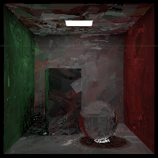

Work from 
[raytracing in one weekend](https://raytracing.github.io/)

Uses the stb library 
([stb_image_write.h](https://github.com/nothings/stb/blob/master/stb_image_write.h)) 
to make pngs 

Uses xoshiro 
([xoshiro.hpp](https://gist.github.com/imneme/3eb1bcc5418c4ae83c4c6a86d9cbb1cd)) 
for random number generation

### Multithreading

This project adds multithreaded rendering by chunking image scanlines into separate threads.
This significantly reduces render times but isn't an ideal implementation.
Different parts of the image can be busier than others so threads will arbitrarily take
varying amounts of time to finish.
Ideally, the pixel sampling process would be multithreaded instead.
I have attempted to do this a couple different ways to varying levels of success.

#### Futures

On the `multithread-sampling-futures` branch is an implementation using `std::future` where
each thread accumulates its portion of the sample color independently, after which they are all 
added together.

This unfortunately produces an image which is darker scaling with the number of threads used.
Below is the same scene on one thread and six threads respectively.

This might most obviously be caused by samples being missed.
After verifying however, this isn't the case and the total sample count is as expected.

My only remaining suspicion is some kind of floating point error caused by summing separate 
accumulators rather than always summing a single color value per sample.

#### Shared Accumulator

On the `multithread-sampling-shared` branch is an implementation using a shared color 
accumulator and mutex lock. 
This doesn't seem to work at all and produces an interesting painterly sort of effect in the 
render, as seen below.

#### Some Sample Times

For a 200x200 render on 6 threads

|               | 5000 samples | 1000 samples | 64 samples |
|---------------|--------------|--------------|------------|
| **scanlines** | 953s         | 186s         | 13s        |
| **futures**   | 635s         | 115s         | 20s        |
| **shared**    | 673s         | 137s         | 28s        |

Single thread 1000 sample time of 529s
